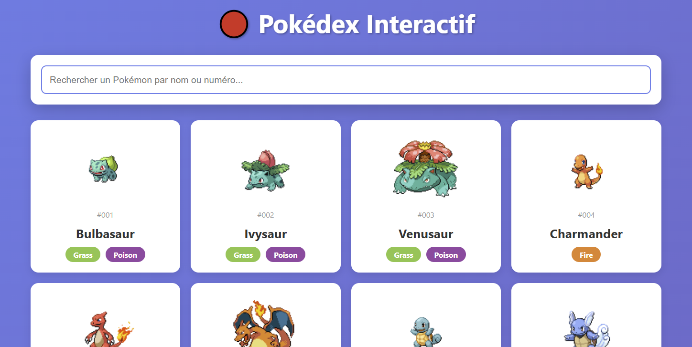

# Pokemons web app

Générée avec Claude.ai en 1 minute, avec le prompt 

```
Utilise la Pokeapi pour créer une web app avec toutes les infos sur les pokemons
Stack : python et framework backend FastAPI"
```

Le chat Claude.ai : https://claude.ai/share/61c008e6-8548-4fa8-bbc7-3355324d3b6b 


## Avec docker

Build 

```bash
$ docker compose build
```

Lancement 

```bash
$ docker compose up
```

Ouvrir http://localhost:8377 - la web app apparait

## Isntallation et lancement en local en venv

### uv en venv

```bash
$ uv sync

$ source .venv/Scripts/Activate # Windows
ou 
$ source .venv/bin/activate # Linux / MacOS
```

### Lancement

```bash
$ python app.py
INFO:     Will watch for changes in these directories: ['*****']
INFO:     Uvicorn running on http://0.0.0.1:8377 (Press CTRL+C to quit)
INFO:     Started reloader process [23664] using StatReload
INFO:     Started server process [26972]
INFO:     Waiting for application startup.
INFO:     Application startup complete.
```

Ouvrir http://localhost:8377 - la web app apparait



## Améliorations apportées post génération

Pour exécuter cette web app, les ajustements qui ont été apportées :

- ajout d'uv 
- un template Jinja2 pour le frontend
- .env pour la variable BASE_APP_URL et la route de base pour l'appel de l'API FastAPI (différe entre le localhost et la location sur un VPS)
